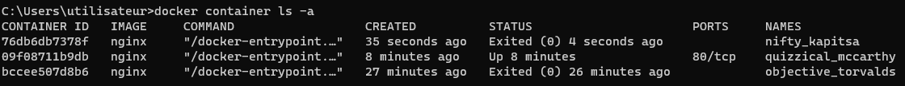
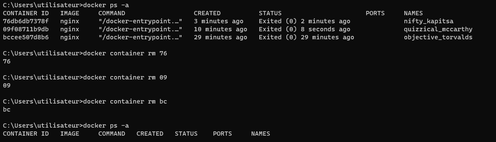
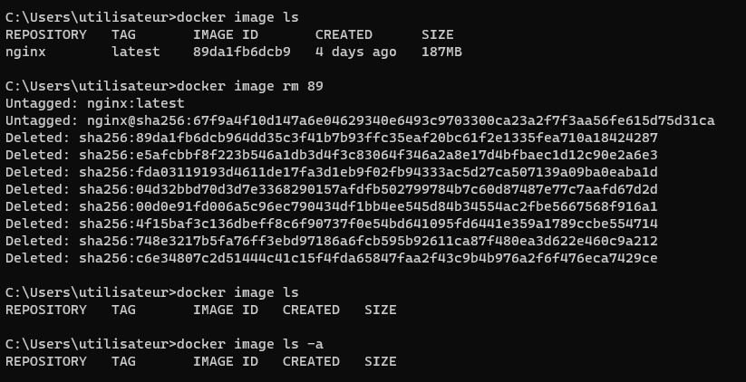
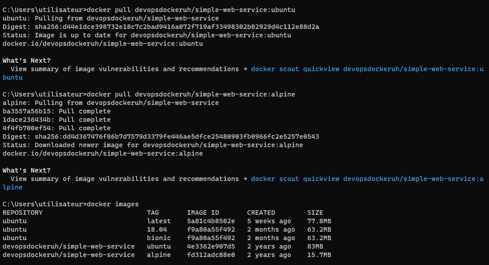

# [DevOps with docker course](https://devopswithdocker.com/)

# Part 1

# Exercise 1.1: Getting started

Since we already did "Hello, World!" in the material let's do something else.

Start 3 containers from an image that does not automatically exit (such as nginx) in detached mode.

Stop two of the containers and leave one container running.

Submit the output for docker ps -a which shows 2 stopped containers and one running.

Solutions : 



# Exercise 1.2: Cleanup

We have containers and an image that are no longer in use and are taking up space. Running docker ps -as and docker images will confirm this.

Clean the Docker daemon by removing all images and containers.

Submit the output for docker ps -a and docker images

Solution :




# Exercise 1.3 : Secret message
Now that we've warmed up it's time to get inside a container while it's running!

Image devopsdockeruh/simple-web-service:ubuntu will start a container that outputs logs into a file. Go inside the container and use tail -f ./text.log to follow the logs. Every 10 seconds the clock will send you a "secret message".

Submit the secret message and command(s) given as your answer.

Shell 
```bash
docker run -d -it --name ubuntu devopsdockeruh/simple-web-service:ubuntu

docker exec -it  ubuntu
```

Reponse : Secret message is: 'You can find the source code here: https://github.com/docker-hy'


# Exercise 1.4 : 

Solution :
Shell 
```bash
docker run -d -it --name script ubuntu sh -c "while true; do echo 'Input website:'; read website; echo 'Searching..'; sleep 1; curl http://$website; done"
* note : "" car sous windows sinon ''
docker exec -it script

apt-get update
apt-get -y install curl
```
Ouvrir nouveau terminal 
shell 
```bash
docker attach script
helsinki.fi
```

# Exercise 1.5 : 

Part 1 : 


l'image ubuntu est bcp plus grosse que l'image alpine

Part 2 : 
Shell
```bash
docker run -d --name alpine devopsdockeruh/simple-web-service:alpine
docker exec -it alpine
```

Output
```
Secret message is: 'You can find the source code here: https://github.com/docker-hy'
```


# Exercise 1.6 

go to : https://hub.docker.com/r/devopsdockeruh/pull_exercise

Shell 
```bash
docker run -it devopsdockeruh/pull_exercise
basics
```

Output 
```
You found the correct password. Secret message is:
"This is the secret message"
```
# Exercise 1.7: Image for script

Solution : 

1-7.sh
```bash
#!/bin/sh
while true
do
  echo "Input website:"
  read website; echo "Searching.."
  sleep 1; curl http://$website
done
```

> Sous windows les fichiers sont save avec le format de fin de ligne CRLF alors que dans notre cas dans les systeme UNIX les fichers doivent etre save avec le format de fin de ligne LF. On peut le faire avec VScode : ouvrir le fichier -> ctrl + shift + p (ouvrir la palette de commande) -> change end of line sequence -> choisir LF

Dockerfile 
```bash
FROM ubuntu:20.04

# Use /usr/src/app as our workdir. The following instructions will be executed in this location.
WORKDIR /usr/src/app

# Copy the hello.sh file from this location to /usr/src/app/ creating /usr/src/app/hello.sh
COPY 1-7.sh .

# Execute a command with `/bin/sh -c` prefix.
RUN apt-get update
RUN apt-get -y install curl

# Alternatively, if we skipped chmod earlier, we can add execution permissions during the build.
RUN chmod +x 1-7.sh

# When running docker run the command will be ./hello.sh
CMD ./1-7.sh
```

Shell 
```bash
docker build . -t curler
docker run -it curler
helsinki.fi
```


# Exercise 1.8 : Two line Dockerfile
By default our devopsdockeruh/simple-web-service:alpine doesn't have a CMD. It instead uses ENTRYPOINT to declare which application is run.

We'll talk more about ENTRYPOINT in the next section, but you already know that the last argument in docker run can be used to give a command or an argument.

As you might've noticed it doesn't start the web service even though the name is "simple-web-service". A suitable argument is needed to start the server!

Try docker run devopsdockeruh/simple-web-service:alpine hello. The application reads the argument "hello" but will inform that hello isn't accepted.

In this exercise create a Dockerfile and use FROM and CMD to create a brand new image that automatically runs server.

The Docker documentation CMD says a bit indirectly that if a image has ENTRYPOINT defined, CMD is used to define it the default arguments.

Tag the new image as "web-server"

Return the Dockerfile and the command you used to run the container.

Running the built "web-server" image should look like this:
```bash
$ docker run web-server
[GIN-debug] [WARNING] Creating an Engine instance with the Logger and Recovery middleware already attached.

[GIN-debug] [WARNING] Running in "debug" mode. Switch to "release" mode in production.
- using env:   export GIN_MODE=release
- using code:  gin.SetMode(gin.ReleaseMode)

[GIN-debug] GET    /*path                    --> server.Start.func1 (3 handlers)
[GIN-debug] Listening and serving HTTP on :8080

```

    - We don't have any method of accessing the web service yet. As such confirming that the console output is the same will suffice.

    - The exercise title may be a useful hint here.

Solution : 

Dockerfile 
```bash
FROM devopsdockeruh/simple-web-service:alpine
CMD server
```

Shell 
```bash
docker build . -t web-server
docker run -it web-server
```

# Exercise 1.9: Volumes

In this exercise we won't create a new Dockerfile.

Image devopsdockeruh/simple-web-service creates a timestamp every two seconds to /usr/src/app/text.log when it's not given a command. Start the container with bind mount so that the logs are created into your filesystem.

Submit the command you used to complete the exercise.

Hint: read the note that was made just before this exercise!

Solution :
Shell (windows)
```bash
ni log.txt

docker run -v "$(pwd)/log.txt:/usr/src/app/text.log" devopsdockeruh/simple-web-service
```

Check log.txt pour voir si ca écrit bien dedans.


# Exercise 1.10: Ports open

In this exercise, we won't create a new Dockerfile.

The image devopsdockeruh/simple-web-service will start a web service in port 8080 when given the argument "server". In Exercise 1.8 you already did a image that can be used to run the web service without any argument.

Use now the -p flag to access the contents with your browser. The output to your browser should be something like: { message: "You connected to the following path: ...

Submit your used commands for this exercise.

Solution : 

Shell
```bash
docker run -p 8080:8080 web-server
```

ouvrir 127.0.0.1:8080/ il y a normalement : message	"You connected to the following path: /"


# Exercise 1.11: Spring

Create a Dockerfile for an old Java Spring project that can be found from the course repository.

The setup should be straightforward with the README instructions. Tips to get you started:

Use openjdk image FROM openjdk:_tag_ to get Java instead of installing it manually. Pick the tag by using the README and Docker Hub page.

You've completed the exercise when you see a 'Success' message in your browser.

Submit the Dockerfile you used to run the container.

Solution : 

Dockerfile 
```bash
# get java 8
FROM openjdk:8

EXPOSE 8080

WORKDIR usr/src

COPY . .

# build the project
RUN ./mvnw package

# run
CMD ["java", "-jar", "./target/docker-example-1.1.3.jar"]
```

Shell 
```bash
docker build . -t spring-project

docker run -p 8080:8080 spring-project
```

Ouvrir 127.0.0.1:8080 cliquer sur le button, voir success!